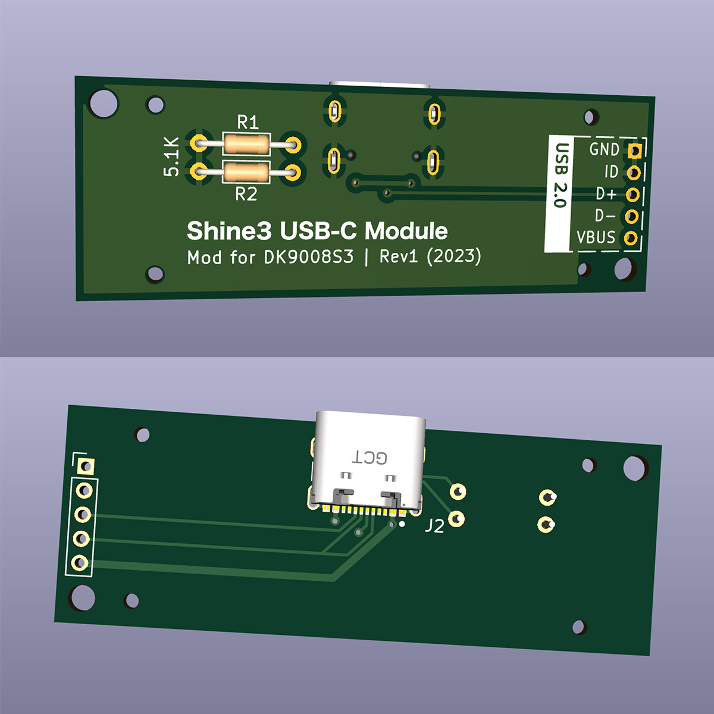
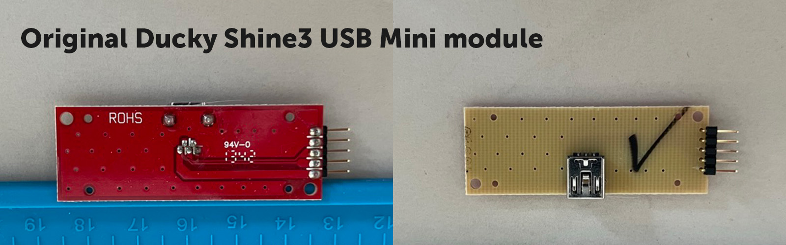

# Ducky Shine3 USB-C Mod

Unofficial USB 2.0 Type C replacement module for the Ducky Shine3 (DK9008S3) mechanical keyboard first released in 2013.

This module is ment to replace the original USB 2.0 mini port on the Ducky Shine3, making it compatible with any USB C data cable.

The project includes KiCad files. Feel free to edit and modify to your own needs. This also includes the gerber files if you want to order this PCB without doing any modifications. I've had one successful order of this PCB from JLCPCB without any issues.

To install this module you will have to slightly enlarge the USB connector opening in the hard plastic shell of the keyboard. I did this using my soldering iron and then tidied it up with a small file.

## KiCad

External footprint
* USB-C Connector: [USB4085-GF-A ](https://www.snapeda.com/parts/USB4085-GF-A/Global%20Connector%20Technology/view-part/)

## PCB Specifications
| Specification | Value            |
| ------------- | ---------------- |
| Dimensions    | 50 x 18 mm       |
| Thickness     | 1 mm             |
| Layers        | 2                |
| Copper        | 1 oz (35μm)      |
| Via covering  | Tented or filled |

## Parts
Parts needed to assemble the PCB.
| Amount | Part type                    | Part name                                                                     |
| ------ | ---------------------------- | ----------------------------------------------------------------------------- |
| 1      | USB2.0 Type C 16+8 connector | [USB4085-GF-A](https://www.digikey.com/en/products/detail/gct/USB4085-GF-A/9859662) |
| 1      | 1x5 right angle connector    | [2PH1R-05-UAA](https://www.digikey.se/en/products/detail/adam-tech/2PH1R-05-UA/9830981) |
| 2      | 5.1 kOhms resistor           | [RNMF14FTC5K10](https://www.digikey.se/en/products/detail/stackpole-electronics-inc/RNMF14FTC5K10/2617363) |
